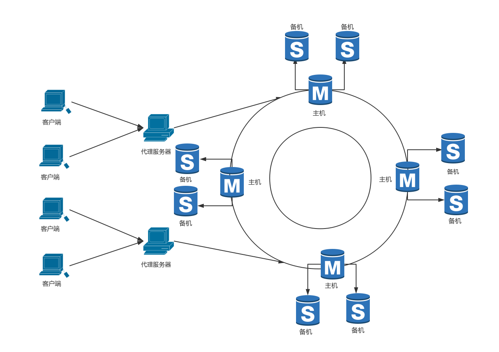

# 总体架构设计

### 总体逻辑设计.
* 代理服务器启动,根据配置文件,连接个数据服务器.
* 客户端发送存储命令给代理服务器,由代理服务器进行一致性hash发送到不同的数据库服务器。
* 添加一个节点,会均衡的把其它节点上的数据迁移一部分到此新节点上.
* 删除一个节点,会均衡的把此节点上的数据迁移到不同的节点上. 
* 每一个节点都有两个备机,当主服务器宕机后,代理服务器能自动切换一个从服务器当做主服务器,并且继续监控下线的主服务器,等待上线后,成为备机.
