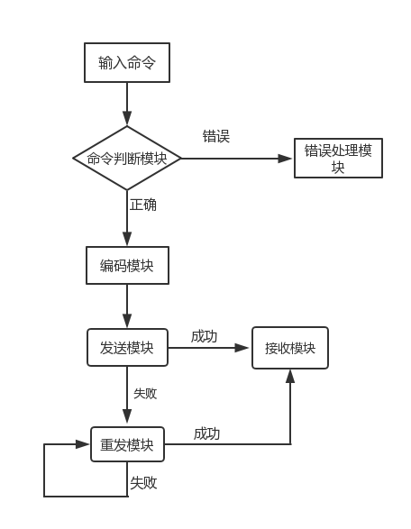

## StormDB
### 简介
该项目是一个支持SDS、列表、字典、整数集合、跳跃表等数据结构的分布式缓存数据库,实现各种数据结构的增、删、改、查。
### 客户端设计
由输入模块接收终端的输入，送到命令参数判断模块对输入的存取命令进行判断，然后送到编码模块对存取命令去序列化,序列化完成后在头部添加长度信息，转交给发送模块进行发送，然后调用接收对存取命令的返回值进行接收输出。流程图如下:

### 负载服务器设计
#### 网络部分:
##### 网络库:
* 采用主从Reactor多线程模型，主线程接受连接，通过eventfd机制传递给子线程处理连接。基于C++11 Function 回调机制处理可读、可写、连接、错误事件。把这些事件由给用户自定义。
* 采用non-blocking+IO-muleiplexing，采用这种模式的原因有两点:
    * 没有人会用轮询来检查某个non-blocking IO 操作是否完成，这样太浪费CPU，
    * IO-muleiplesing一般不能和blocking IO用在一起,因为blocking IO中的read()/write()/connect()都有可能阻塞当前线程，这样线程就没办法处理其他socket的IO事件。　　　
#### 网络库主要类介绍
* BaseLoop类:开启loop线程，接受连接,并通过eventfd机制以轮询的方式传递给loop线程。  
* Buffer类:Tcp是一个无边界的字节流协议，接受方处理"收到的数据尚不构成一条完整的消息"和"一次收到两条消息的数据"等等情况。此Buferr对外表现为一块连续的内存,可以自动增长，以适应不同大小的消息,使用栈空间解决大数据buffer缓冲区不足的问题,避免了开巨大的Buffer造成内存浪费,也避免反复调用read()的系统开销，使用vector的capacity机制减少内存分配次数。使用内部腾挪，减少内存分配。send 采用的小数据直接发送,发送失败才注册epoll的写事件，减少系统调用.  
* Callback：使用c++11 function 机制封装的事件回调函数。  
* Epoll：对事件epoll 事件增、删、改。  
* Connection：对每一个客户端连接的封装,包装send函数.  
* ObhectPoll:对象池，缓存连接类,提高网络库的性能.   
* Eventloop：loop线程,一个loop线程一个epoll，处理可读,可写,关闭,连接，错误事件。调用相应的回调函数.处理事件.  
* EventLoopPool:Eventloop池,解决每个loop线程均衡的负载客户端的连接。  
* SyncQueue：同步队列。
* ThreadPool:线程池,有一个SyncQueue，用于存储任务,线程池用户处理任务。
* Server：用于启动网络模块。    
#### 内部网络
内部使用单独的epoll管理所有数据库服务器，只负责监听所有数据库服务器的读事件,发送采用线程池+任务队列，提高服务性能。     
#### 一致性哈希
读取配置文件连接数据库服务器，根据配置文件把计算每个实节点所对应所有虚拟节点的Md5值，然后根据得到的md5值计算hash值,hash到hash环上，给每一虚拟节点保存对应实节点的节点。  
#### 数据库服务器   
采用单线程epoll线程保证操作的原子性。线程池+SyncQueue执行存取命令并发送返回值。      
##### 数据库服务器的主要数据结构
* String 类:简单的字符串，用size,free分别表示字符串已用大小和空余大小，采用预分配策略，减少内存分配,重载<,>,==,<<,>>,+,+,=,=,[],+=。　　
* StormDB_intset：整数集合，以第一插入的数值的类型为最初类型,比如说,uint16_t,当以后插入一个uint32_t,或者uint64_t的类型时，能自动升级为uint32_t或uint64_t类型。    
* StormDB_skilplist:跳跃表,用于有序集合的查找，插入，和删除。跳表的第一层包含所有的元素,在插入元素时，采用随机函数随机一个0-设置的最大层数，如果大于已有的层数,增增加一层,并在以下的每层找到相应的位置插入该新值。插入时，用一个临时二维指针数组保存要插入新元素的前一个元素,然后,在从最高层到最底层依次插入新节点.  
* 列表：使用c++list实现,达到一定的阀值向hash表转换.   
* 字典：采用rehash的方式，在hash表用量不足resize = size*2或者总量/已使用的比值大于10时,采用渐进式rehash，resize =size/2; 在删除,添加,查找时需要判断rehash标识是否开启,如果开启,则添加,删除,查找先在hash表中查找，则在rehash表中查找.  用list链地址法来解决hash冲突.
* 每一数据库的键空间都是一个字典。  

